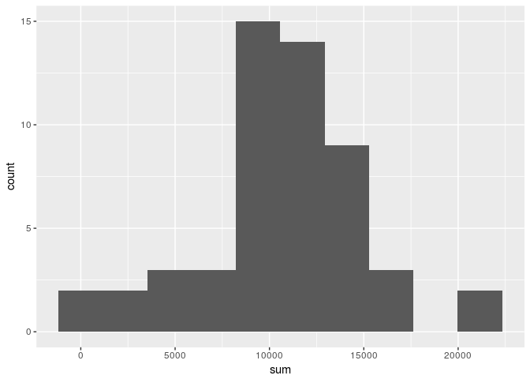
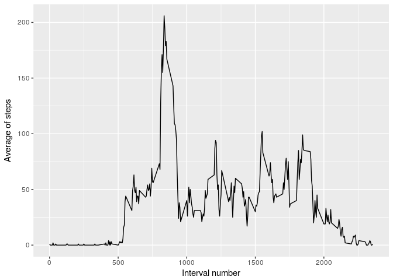
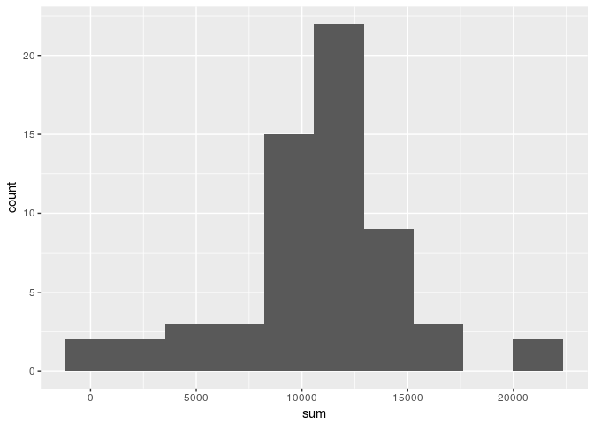
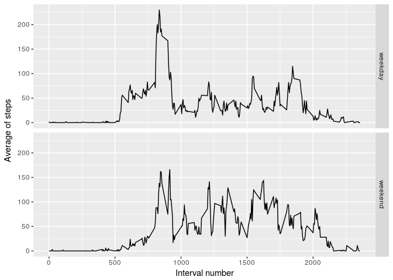

## Importing libraries

First we will import some useful dependencies and set the location for english.


```r
library(dplyr)
```

```
## 
## Attaching package: 'dplyr'
```

```
## The following objects are masked from 'package:stats':
## 
##     filter, lag
```

```
## The following objects are masked from 'package:base':
## 
##     intersect, setdiff, setequal, union
```

```r
library(ggplot2)
```


## Loading and preprocessing the data

The fragment below loads the activity data into a variable we will use for processing.


```r
data <- read.csv("activity.csv")
```

We convert the `date` column to the date class. It will allow us more flexibility later on.


```r
data$date <- as.Date(data$date)
```

Just a quick check to see if we are importing the right file: The dataset file should have 17,568 observations.


```r
dim(data)
```

```
## [1] 17568     3
```

## What is mean total number of steps taken per day?

At this step, we will calculate the average number of steps. Here we repeat the steps given at the exercise description, describing them accordingly.

### Calculate the total number of steps taken per day

First, we should ignore missing values.


```r
steps_a_day <- data[complete.cases(data),]
```

Second, we should aggregate the values on a per-day basis. 


```r
steps_a_day <- steps_a_day %>% group_by(date) %>% summarise(sum = sum(steps))
```
Variable *steps_a_day* contains now the aggregated number of steps for each day.  

## Histogram of the total number of steps taken each day

We now generate a histogram of the total number of steps taken each day.


```r
ggplot(steps_a_day,aes(sum)) + geom_histogram(bins=10)
```

<!-- -->

### The mean and median of the total number of steps

We now calculate the mean and median of the total number of steps.

First, we calculate the mean.


```r
mean(steps_a_day$sum)
```

```
## [1] 10766.19
```

Second, we calculate the median.


```r
median(steps_a_day$sum)
```

```
## [1] 10765
```

## What is the average daily activity pattern?

Here we take the average number of steps for each interval across all days. We are only using complete cases (where all objects from a given line are not *NA*).


```r
avg_steps_interval <- data[complete.cases(data),] %>% group_by(interval) %>% summarise(avg = as.integer(mean(steps)))
ggplot(avg_steps_interval,aes(x=interval,y=avg)) + geom_line(aes(x=interval,y=avg))
```

<!-- -->

The interval with the highest average number of steps is:


```r
as.integer(avg_steps_interval[avg_steps_interval$avg == max(avg_steps_interval$avg), "interval"])
```

```
## [1] 835
```

Presuming the intervals are in ascending order to the minutes of the day, the 835th interval corresponds to the interval starting at minute:


```r
interval <- 5*as.integer(which(avg_steps_interval == 835))
```

Which surprinsingly starts at 8:40.

We take the oportunity to inquire later: What activity is this user doing at this specific time? If we could take a guess, possibly this user is going to work.

## Imputing missing values

We will fill the missing values for the steps column, assuming they have a valid day and interval. Otherwise, we will discard the entire line, as we cannot presume anything at a wrong day and interval.

First, we list the number of missing values.


```r
sum(!complete.cases(data))
```

```
## [1] 2304
```

Let's check if all the incomplete cases are caused by a missing number of steps.


```r
sum(is.na(data$steps))
```

```
## [1] 2304
```

And now we fill the missing data with the average. We will use the `avg_steps_interval` variable to get the average number of steps for a given period. We store the result in a variable called `steps_na_with_avg`.


```r
steps_na_with_avg <- data[is.na(data$steps), ] %>% inner_join(avg_steps_interval, by="interval") %>% mutate(steps = avg) %>% select(steps,date,interval)
steps_na_with_avg <- rbind(steps_na_with_avg,data[!is.na(data$steps),])
steps_na_with_avg <- steps_na_with_avg %>% group_by(date,interval) %>% arrange()
```

A quick check at the head and the tail of the `steps_na_with_avg`.


```r
head(steps_na_with_avg)
```

```
## # A tibble: 6 x 3
## # Groups:   date, interval [6]
##   steps       date interval
##   <int>     <date>    <int>
## 1     1 2012-10-01        0
## 2     0 2012-10-01        5
## 3     0 2012-10-01       10
## 4     0 2012-10-01       15
## 5     0 2012-10-01       20
## 6     2 2012-10-01       25
```


```r
tail(steps_na_with_avg)
```

```
## # A tibble: 6 x 3
## # Groups:   date, interval [6]
##   steps       date interval
##   <int>     <date>    <int>
## 1     0 2012-11-29     2330
## 2     0 2012-11-29     2335
## 3     0 2012-11-29     2340
## 4     0 2012-11-29     2345
## 5     0 2012-11-29     2350
## 6     0 2012-11-29     2355
```

And also a quick look to see if there are any missing data and the data frame size.


```r
sum(is.na(steps_na_with_avg))
```

```
## [1] 0
```


```r
dim(steps_na_with_avg)
```

```
## [1] 17568     3
```

Now we plot a histogram of the number of steps taken each day.


```r
steps_na_with_avg_day <- steps_na_with_avg %>% group_by(date) %>% summarise(sum=sum(steps))
ggplot(steps_na_with_avg_day, aes(sum)) + geom_histogram(bins=10) 
```

<!-- -->

When comparing to the case when we ignored the missing data, the latter indicates a higher distribution for a greater number of steps taken. This is presumably expected, as in the former case, we simply ignored the data. 

We certainly know that ignoring the missing data is not good, however we are also not sure about how good is our chosen strategy for filling them. We presume there are better options. Some of them may appear when we analyze the distribution for weekdays versus weekends.

The average and the mean of the number of steps taken each day is calculated below.


```r
mean(steps_na_with_avg_day$sum)
```

```
## [1] 10749.77
```


```r
median(steps_na_with_avg_day$sum)
```

```
## [1] 10641
```

We have noticed not a big change on the meand and median to when we just ignored the missing intervals. This is again expected. As we filled missing data with the corresponding average for the interval, we do not expect large increases for any of these terms.

## Are there differences in activity patterns between weekdays and weekends?

Let's create another column for a logical vector indicating if the date is a weekday. It uses a trick: We take the modulo 6 of the numerical weekday. If it is zero, then it is sunday or saturday.


```r
steps_na_with_avg$is_weekday <-  as.POSIXlt(steps_na_with_avg$date)$wday %% 6 != 0
steps_na_with_avg$is_weekday <-  ifelse(steps_na_with_avg$is_weekday, "weekday", "weekend")
steps_na_with_avg$is_weekday <-  as.factor(steps_na_with_avg$is_weekday)
```

Finally, we plot the average for every interval if it is a weekday or not.


```r
steps_na_with_avg_weekday <- steps_na_with_avg %>% group_by(is_weekday, interval) %>% summarise(avg = as.integer(mean(steps)))
ggplot(steps_na_with_avg_weekday,aes(interval,avg)) + facet_grid( is_weekday ~ .) + geom_line() + labs(y = "Average of steps", x = "Interval number")
```

<!-- -->

We notice two interesting points: First, the peak we see at the daily activity pattern occurs only at weekdays. This suggests causality between some activity that repeats during workdays. Second, the number of steps on the weekends is higher in the afternoon and at night. Does this user enjoys a nightlife on saturday and sunday?
